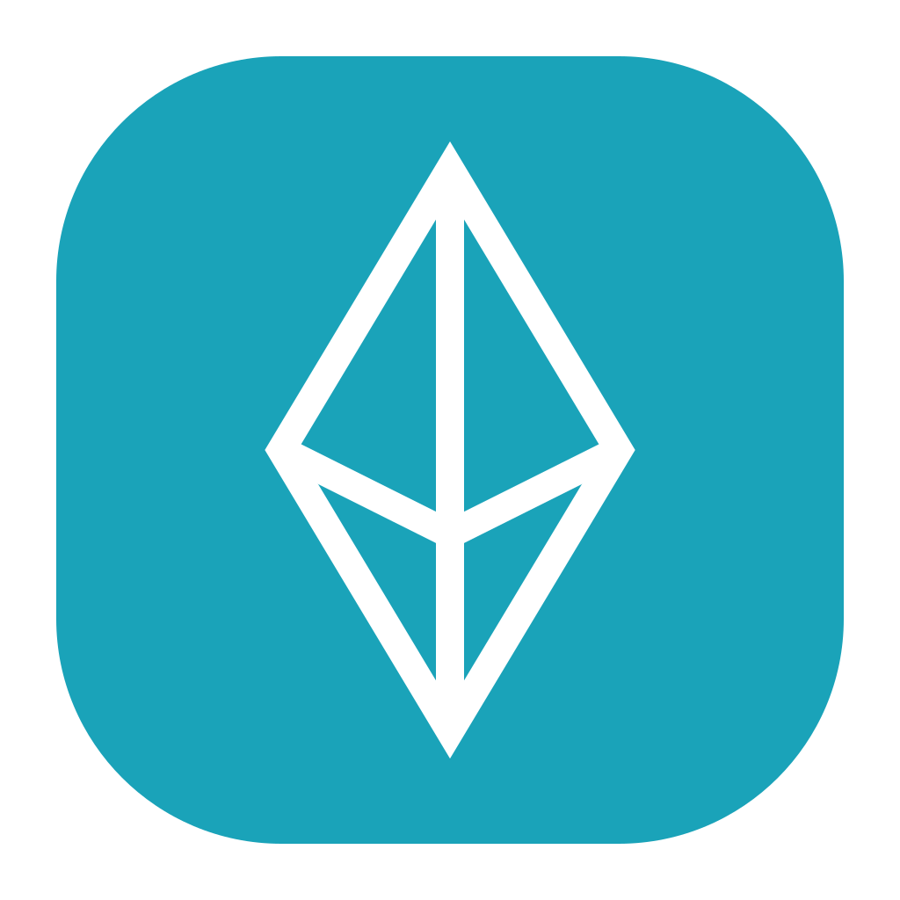
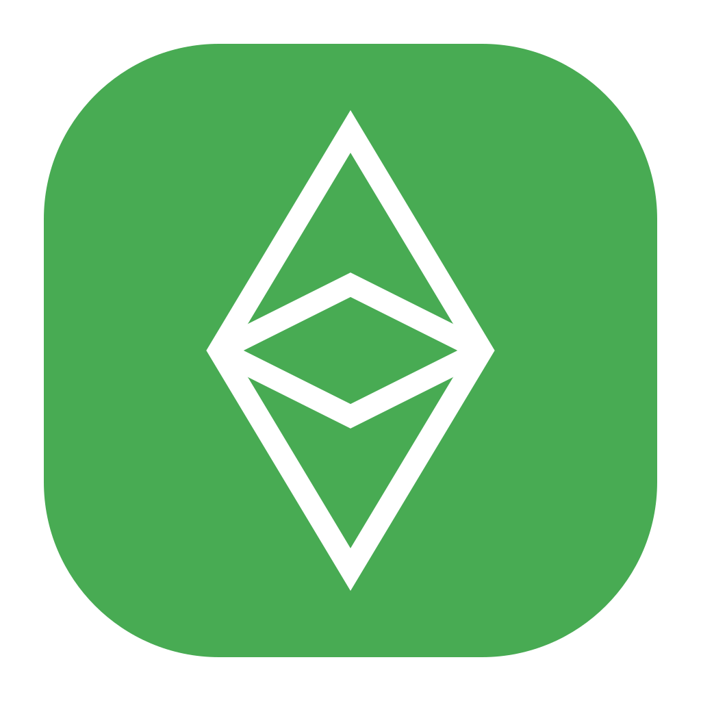
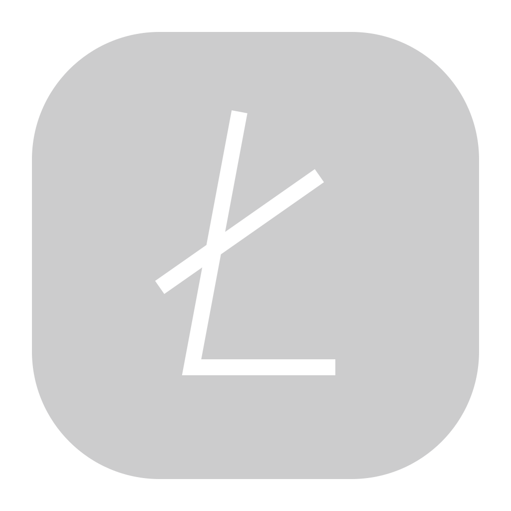
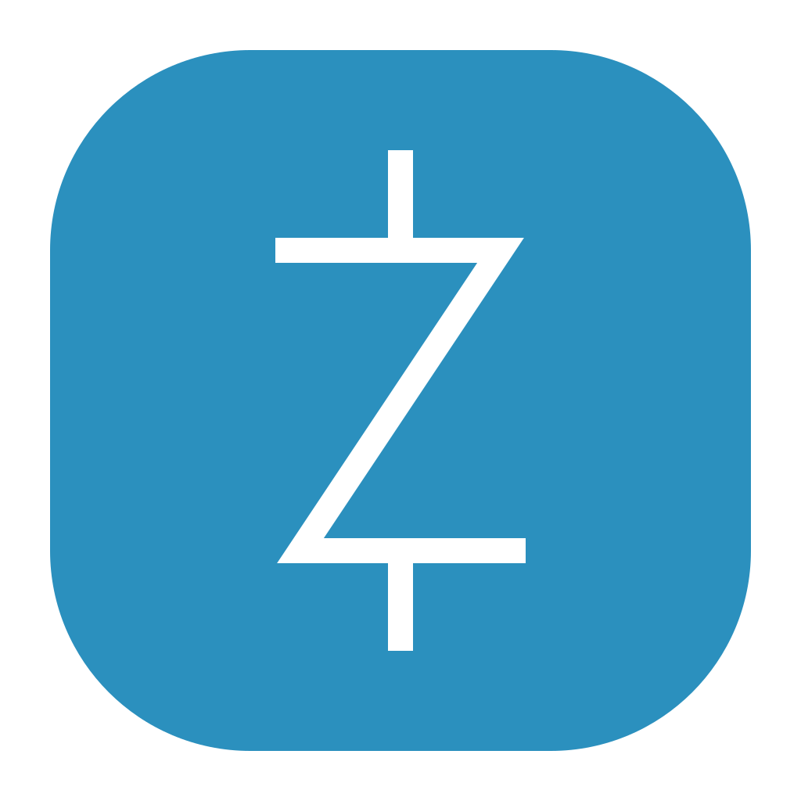
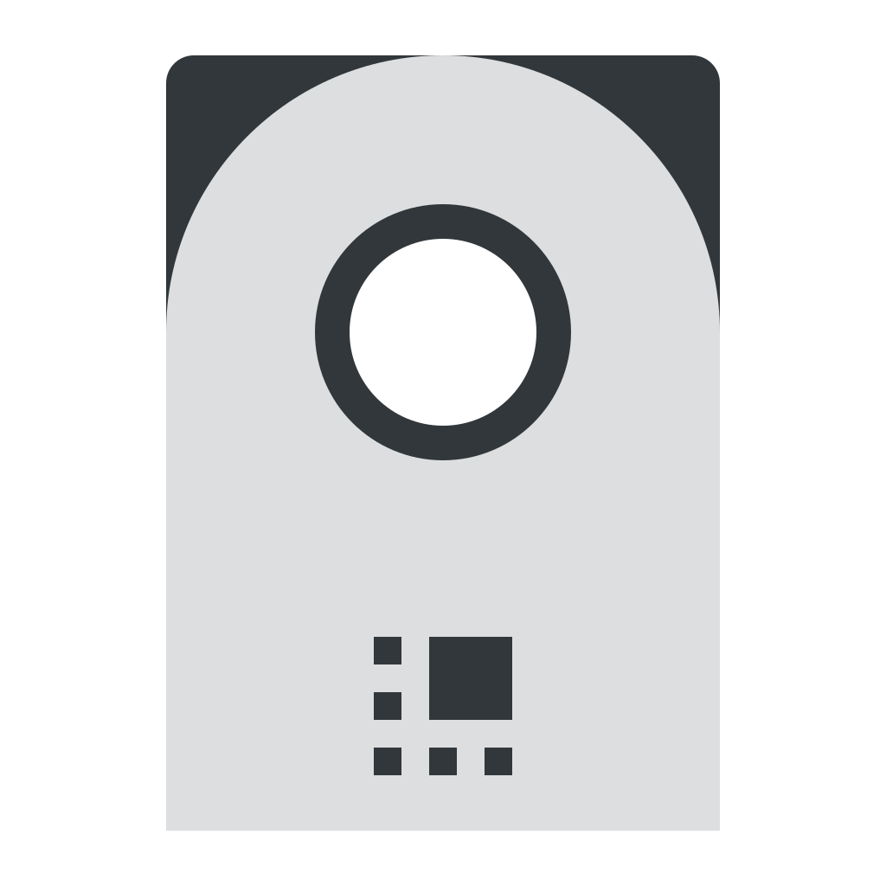
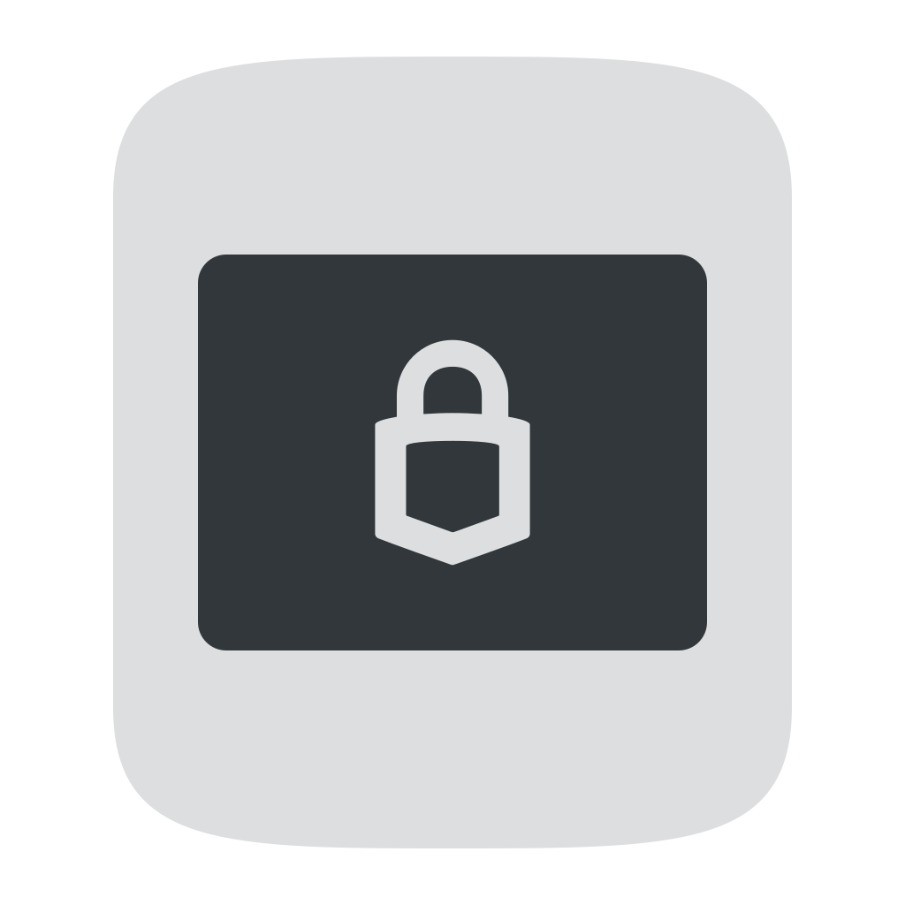

# icons
                                                                                                                                                                                        
# icons_currencies
     
# icons_wallets
  
